# Pipeline Architecture

Complete visual documentation of the CI/CD pipeline implementation.

---

## High-Level Overview
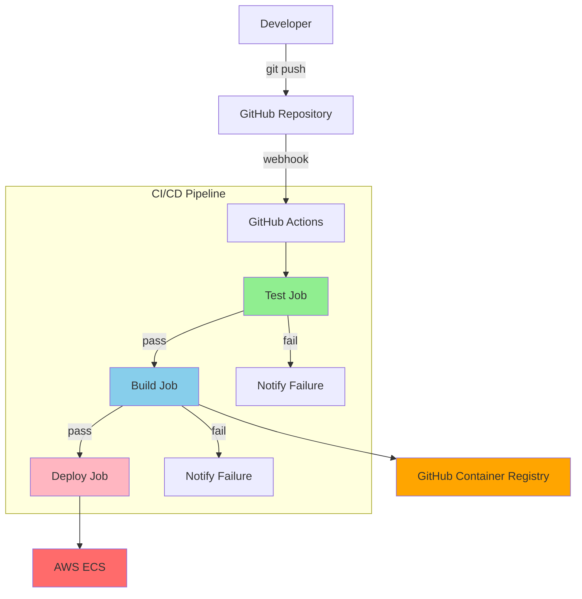

---

## Detailed Pipeline Flow

### 1. Trigger Events
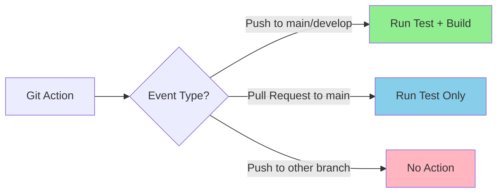

**Trigger Configuration:**
```yaml
on:
  push:
    branches: [ main, develop ]
  pull_request:
    branches: [ main ]
```

---

### 2. Job Dependencies
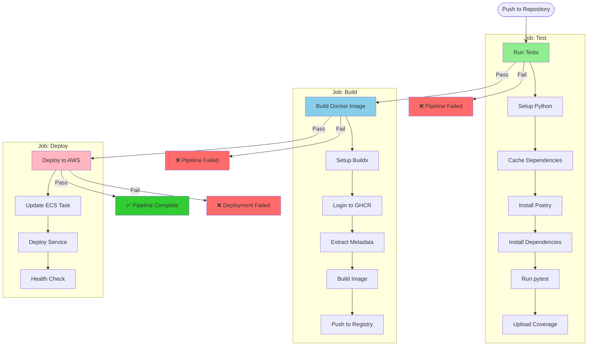

---

## Job Details

### Job 1: Test

**Purpose**: Validate code quality and functionality
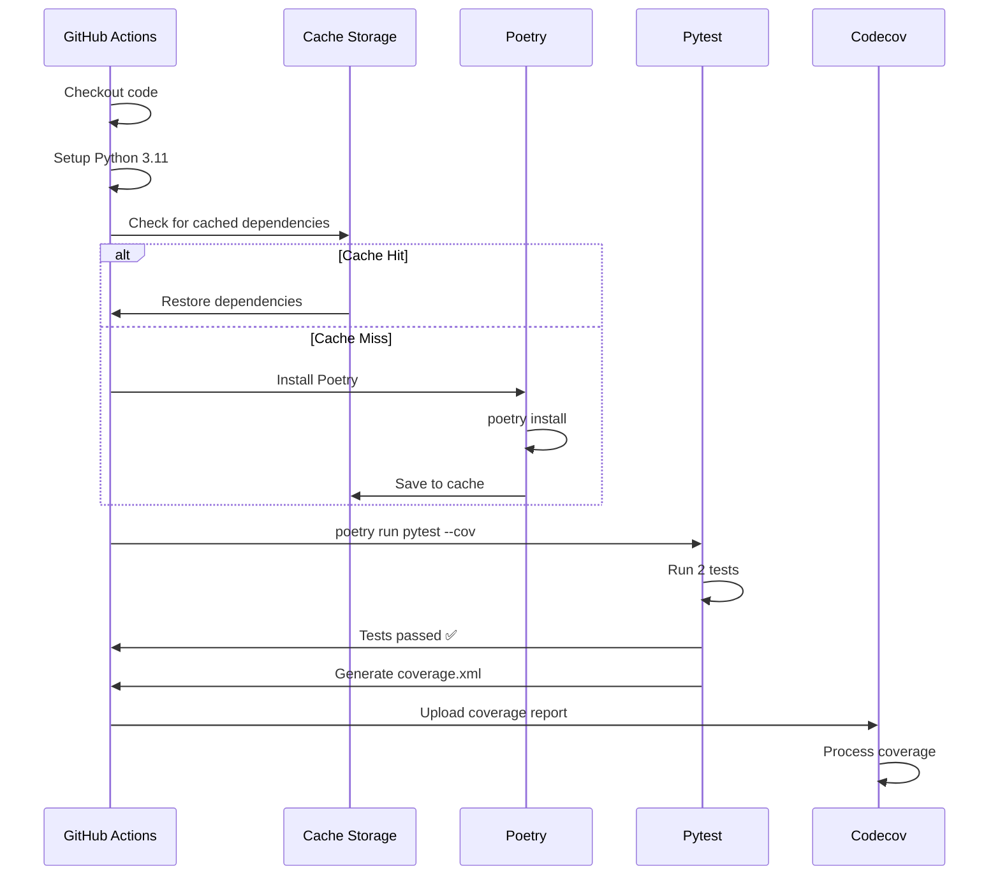

**Key Metrics:**
- Runtime: ~1-2 minutes (with cache)
- Coverage: 100%
- Tests: 2 passing

---

### Job 2: Build

**Purpose**: Create production-ready Docker image
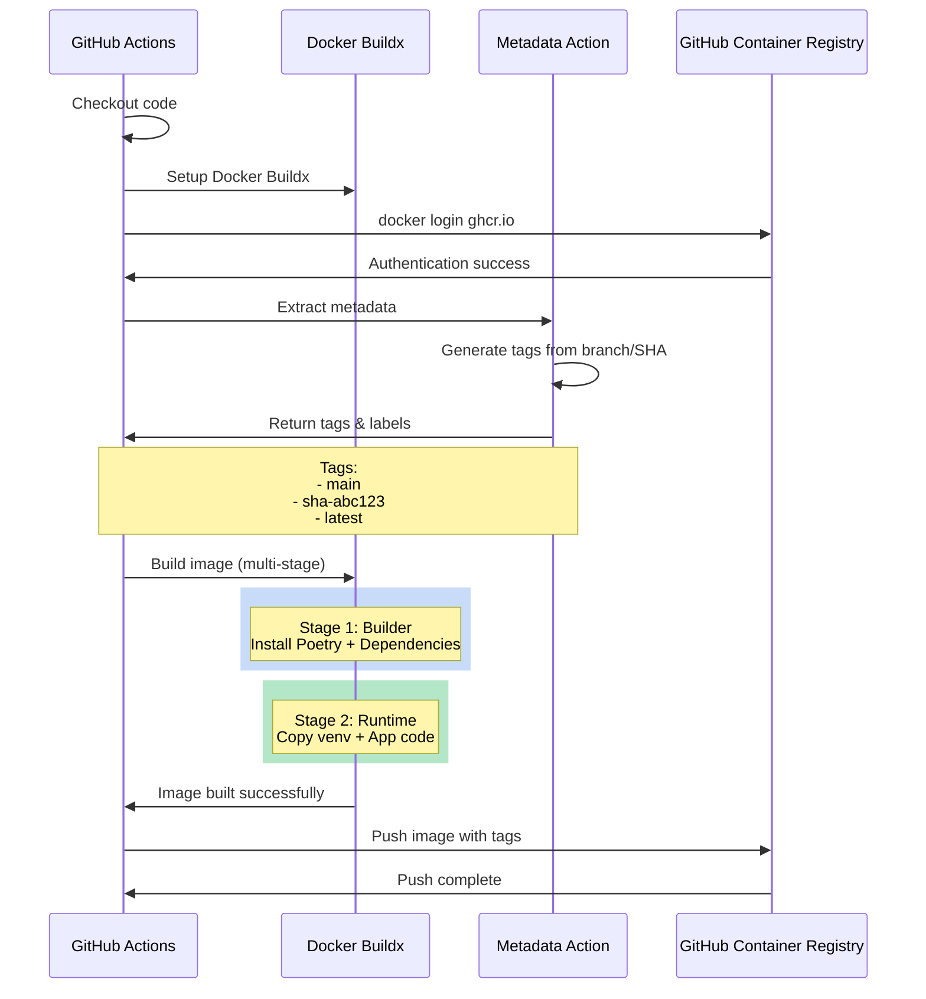

**Key Metrics:**
- Runtime: ~2-3 minutes (with cache)
- Image Size: ~170 MB
- Tags Generated: 3 (branch, SHA, latest)

---

## Docker Build Strategy

### Multi-Stage Build Process
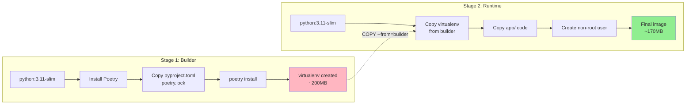

**Why Multi-Stage?**

| Aspect | Single Stage | Multi-Stage |
|--------|--------------|-------------|
| Final Size | ~400 MB | ~170 MB |
| Contains Poetry? | ✅ Yes | ❌ No |
| Build Tools? | ✅ Yes | ❌ No |
| Security Surface | Large | Small |

---

## Image Tagging Strategy
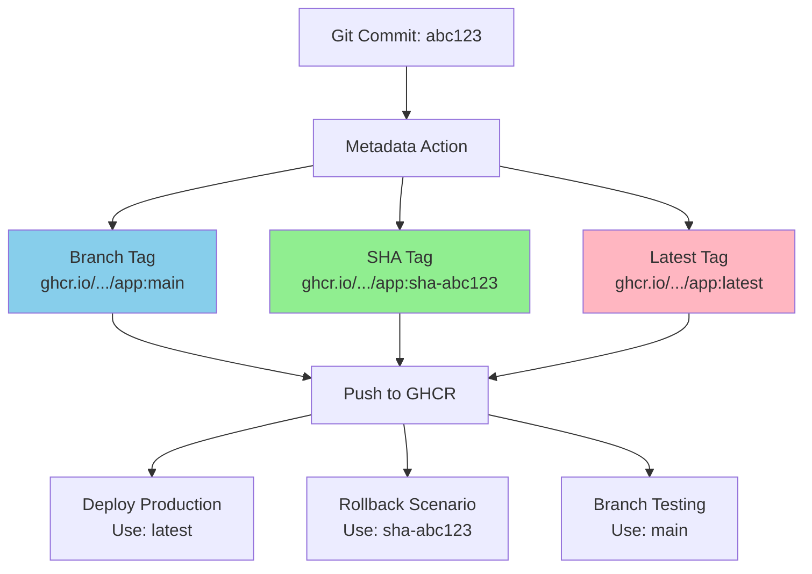

**Tag Strategy Benefits:**

| Tag Type | Use Case | Example |
|----------|----------|---------|
| `branch` | Environment-specific | `main`, `develop` |
| `sha-*` | Exact version tracking | `sha-abc123` |
| `latest` | Production default | `latest` |

---

## Caching Strategy

### Poetry Dependencies Cache
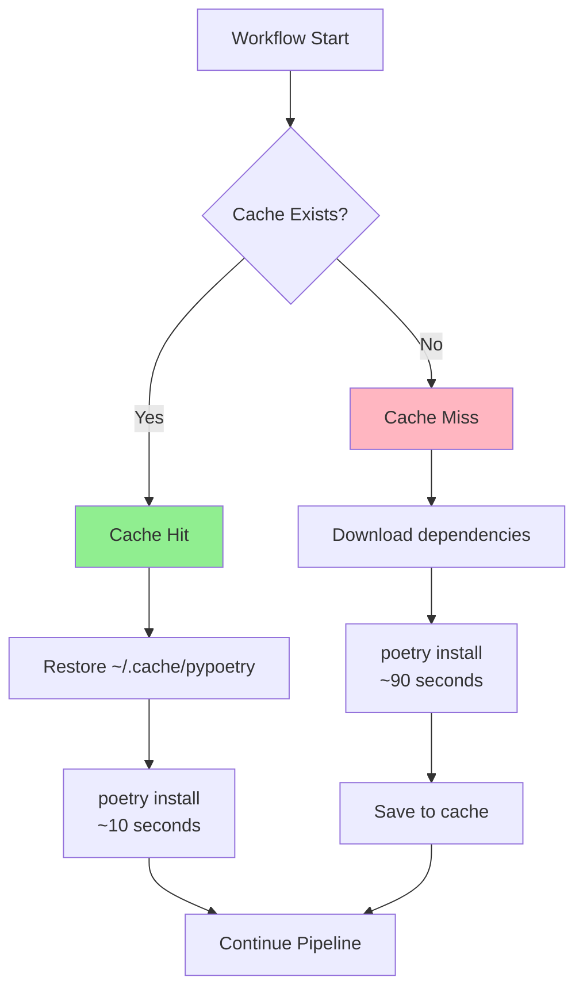

**Cache Key:**
```yaml
key: ${{ runner.os }}-poetry-${{ hashFiles('poetry.lock') }}
```

**When Cache Invalidates:**
- ✅ poetry.lock changes
- ✅ OS changes (Linux → macOS)
- ❌ App code changes (no impact)

---

### Docker Layer Cache
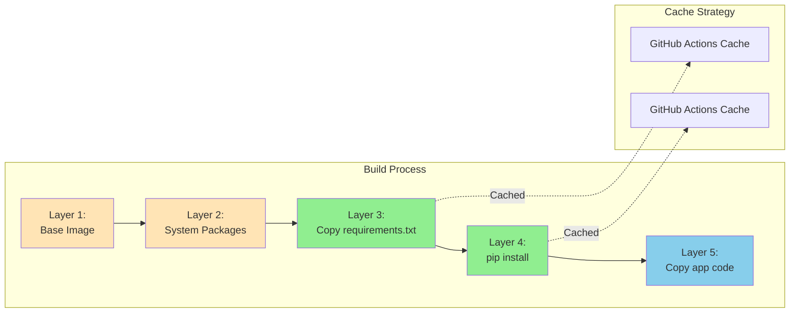

**Layer Caching Benefits:**

| Scenario | Without Cache | With Cache |
|----------|---------------|------------|
| Fresh build | 180 seconds | 180 seconds |
| Code change | 180 seconds | 30 seconds |
| Dependency change | 180 seconds | 90 seconds |

---

## Security Flow
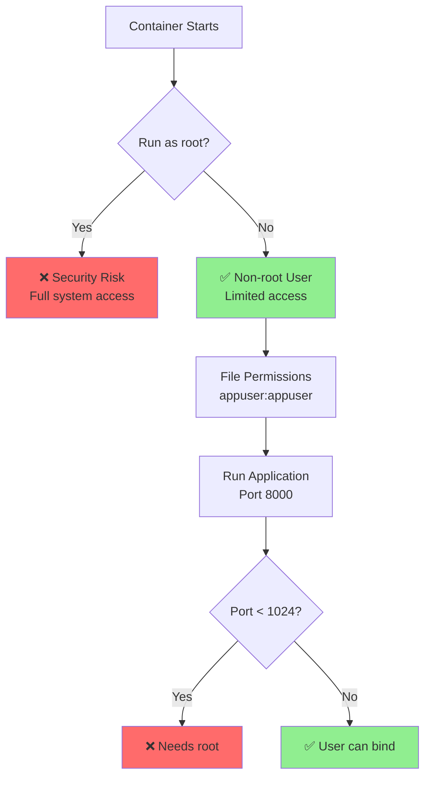

**Security Practices:**
```dockerfile
# ❌ Bad Practice
USER root
CMD ["uvicorn", "app.main:app", "--port", "80"]

# ✅ Good Practice
USER appuser
CMD ["uvicorn", "app.main:app", "--port", "8000"]
```

---

## Deployment Flow (Planned)
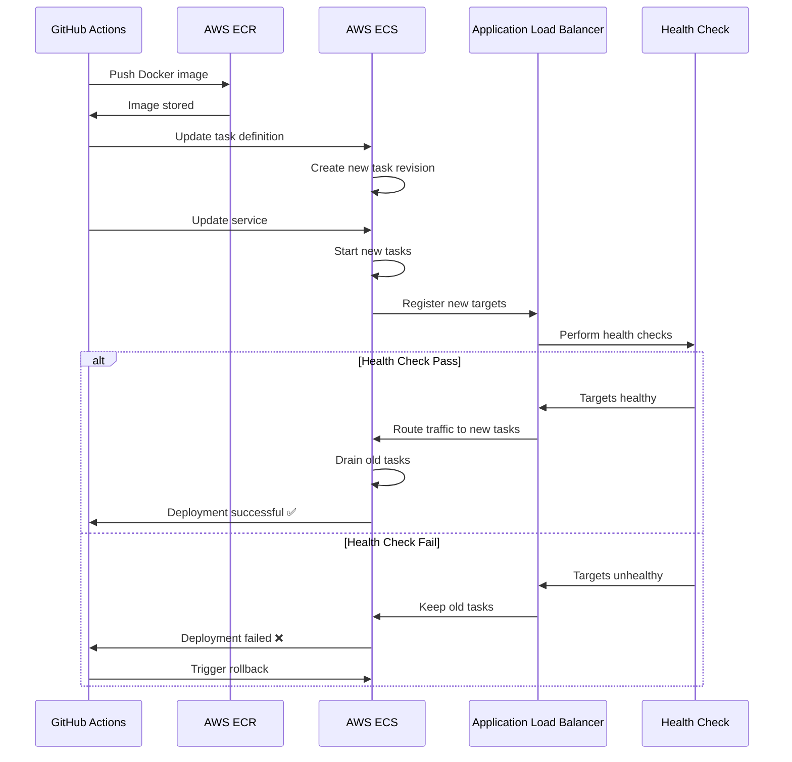

---

## Monitoring & Observability (Planned)
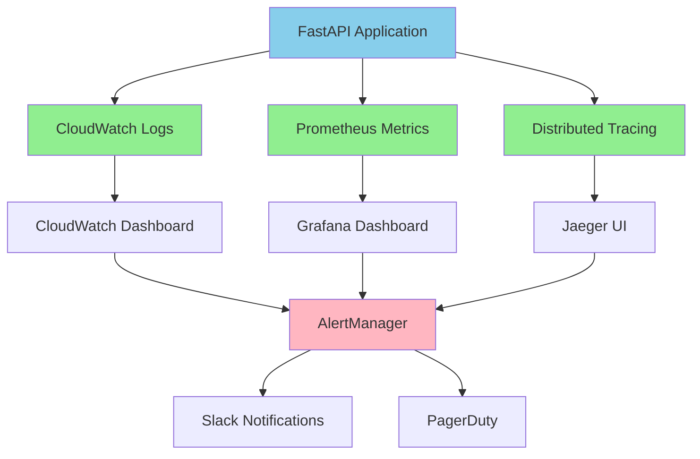

---

## Performance Metrics

### Build Time Breakdown
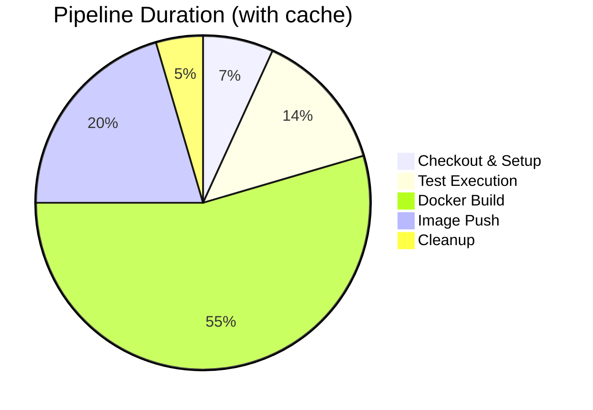

**Total**: ~3.5 minutes

### Resource Usage
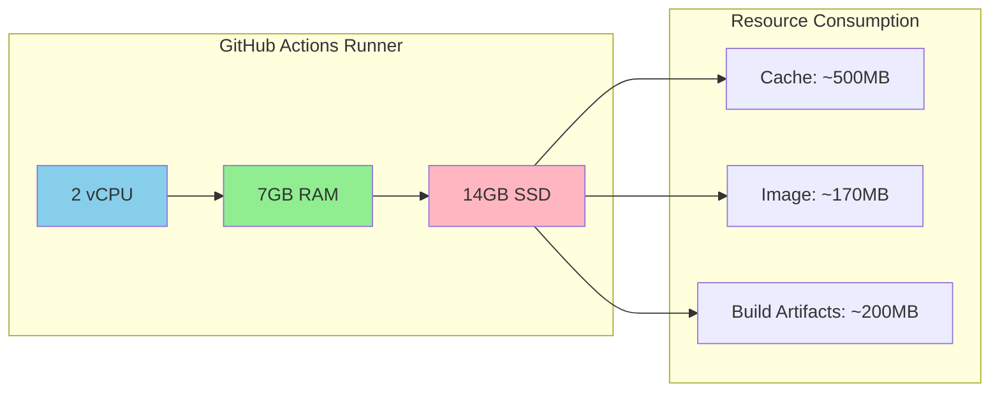

---

## Cost Analysis

### GitHub Actions (Free Tier)

| Resource | Limit | Usage | Status |
|----------|-------|-------|--------|
| Minutes/month | 2,000 | ~100 | ✅ 5% |
| Storage | 500 MB | ~170 MB | ✅ 34% |
| Concurrent jobs | 20 | 1 | ✅ 5% |

**Estimated Monthly Cost**: $0 (within free tier)

---

## Error Handling

### Pipeline Failure Scenarios
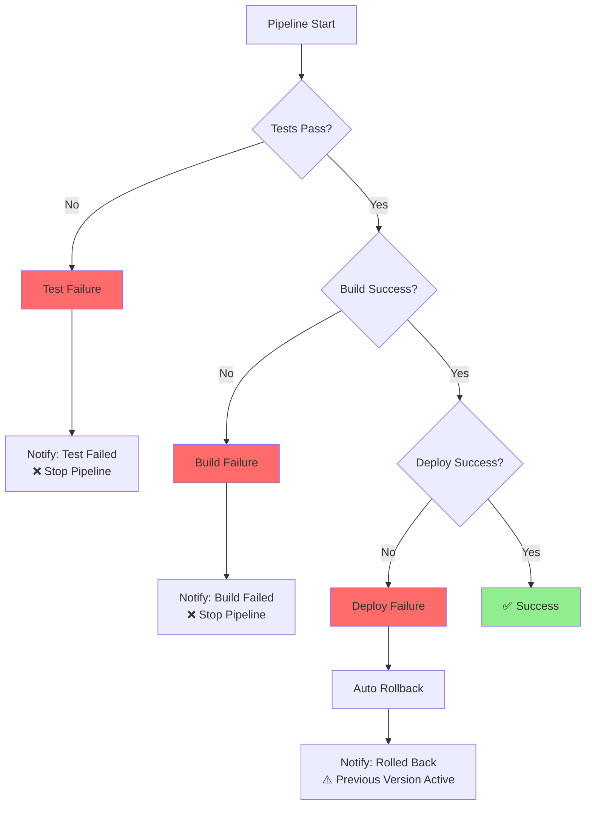

---

## Comparison with Alternative Approaches

### GitHub Actions vs Jenkins

| Aspect | GitHub Actions | Jenkins |
|--------|----------------|---------|
| **Setup** | Zero infrastructure | Requires server |
| **Cost** | Free tier (2000 min) | Self-hosted costs |
| **Maintenance** | Managed by GitHub | Self-managed |
| **Integration** | Native GitHub | Plugins needed |
| **Scalability** | Auto-scales | Manual scaling |
| **Learning Curve** | Low (YAML) | Medium (Groovy) |

**When to use GitHub Actions:**
- ✅ GitHub-hosted repositories
- ✅ Simple to medium complexity
- ✅ Want zero maintenance

**When to use Jenkins:**
- ✅ Complex enterprise workflows
- ✅ Non-GitHub repositories
- ✅ Need full control

---

## Future Enhancements
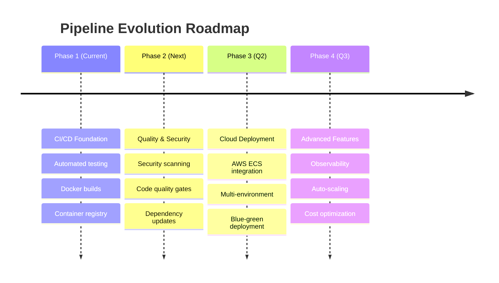

---

## References

- [GitHub Actions Documentation](https://docs.github.com/en/actions)
- [Docker Multi-Stage Builds](https://docs.docker.com/build/building/multi-stage/)
- [GitHub Container Registry](https://docs.github.com/en/packages/working-with-a-github-packages-registry/working-with-the-container-registry)
- [OCI Image Spec](https://github.com/opencontainers/image-spec)

---

**Last Updated**: January 2026
